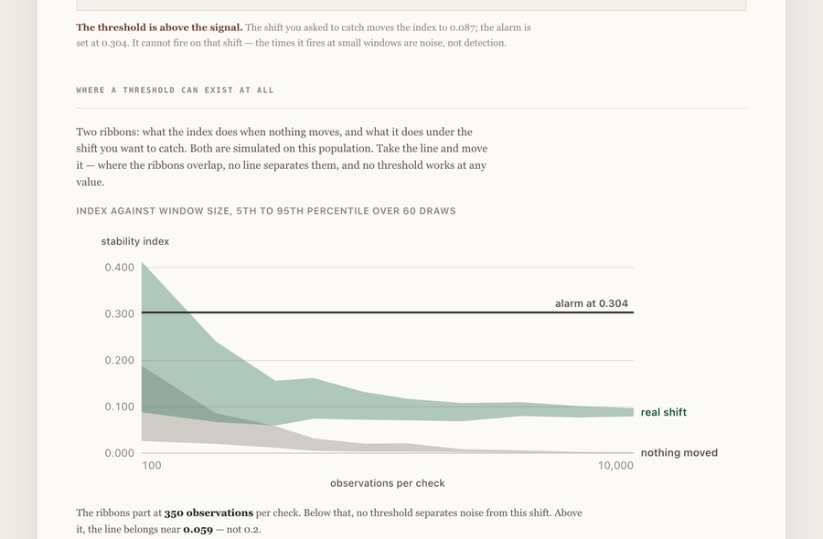

# The drift threshold sits above the signal

Every model-risk note says the same thing: monitor the population stability index, alarm
when it passes **0.2**. That number is repeated as if it were a property of the world. It
is not, and this prices it.

**The finding.** A shift of 0.3 standard deviations — enough to matter on a risk model —
moves the index to **0.090** on this population. The alarm is set at **0.200**. It is above
the signal it exists to see: it cannot fire on that shift at any window size, and the times
it does fire on small windows are noise, not detection. Below **350 observations per check**
the two ribbons overlap and no threshold separates them at all. Where one exists, it belongs
near **0.057**.

**[Try it in your browser →](https://arslanesempai-ui.github.io/drift-monitor/)** — take the
alarm line and move it. The simulation itself runs in the page, at a fixed seed.



```bash
npm start   # the screen, on localhost:4690
npm test    # types and <!--p:portfolio.parDepot.derive-->30<!--/p--> tests
```

Node with native TypeScript, no build step, no runtime dependencies.

---

## Why a folk constant survives

The index of a window is a random variable. Its spread depends on the window size and the
number of bins — on how much data you gathered, not on whether your model is any good. So
the same 0.2 means three different things:

<!-- figures:regimes -->
| Observations per check | Index with no drift, 95th | Index under a 0.3σ shift, 5th | Do they separate? |
|---|---|---|---|
| 100 | 0.186 | 0.067 | no — noise swamps the shift |
| 200 | 0.087 | 0.065 | no |
| 350 | 0.051 | 0.064 | yes, and the line belongs at 0.057 |
| 2,000 | 0.009 | 0.069 | yes, comfortably |
<!-- /figures:regimes -->

At a hundred observations a check, pure noise reaches twice the size of the shift you are
hunting. A threshold there is a coin toss dressed as a control — and the coin lands "alarm"
often enough that the team learns to ignore it.

## What this repository measures, and what it assumes

The population is synthetic and says so. What is **measured** is the behaviour of the
threshold on it: false alarms a year, detection delay, and the two ribbons, all by
simulation at a fixed seed. Repeat a visit and you get the same figure — an outil that
accuses monitors of confusing noise for signal cannot itself flicker.

The one number nobody else can set for you is the shift worth catching. It is not a
statistical quantity: it is the smallest move that would change a decision, and it belongs
to whoever owns the model.

<!-- figures:provenance -->
| | Input | What it is | Why it is that kind |
|---|---|---|---|
| measured | `faussesAlertesParAn` | false alarms a year on a population that did not move | simulated, fixed seed: no closed form survives small windows and quantile bins |
| measured | `delaiMedian` | checks before a real shift is seen | same simulation; drifts never seen inside the year are counted apart, not averaged in |
| assumed | `fenetre` | observations per check | what a weekly or monthly monitoring run actually gathers |
| assumed | `deplacement` | the real shift worth catching, in standard deviations | the smallest move that would change a decision — nobody else can set it for you |
| chosen | `seuil` | the alarm threshold on the stability index | 0.2 is the number every note repeats; this repository exists to price it |

**measured** — run and recorded here  
**assumed** — a figure a reader substitutes their own for  
**chosen** — a figure I picked, and the verdict moves with it
<!-- /figures:provenance -->

## The precaution that is never written down

An empty bin gives a logarithm of zero. Left alone, the index runs to infinity on exactly
the windows where you have least information — so the control screams loudest where it knows
least. Half an observation is substituted per empty bin, and a test holds that the index
stays finite while still calling a genuinely shifted window shifted.
